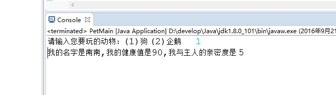

# 2016-09-20工作日志
======================

1. 已完成工作
	instanceof运算符

	 实现与宠物玩耍功能：
	
	 （1）Dog类
	
	package text2;
	
	public class Dog extends Pet{
		
		String strain;
		
		Dog(){
			
		}
		
		Dog(String name,String strain){
			this.name = name;
			this.health = 100;
			this.intimacy = 0;
			this.strain = strain;
		}
		
		public void catchingFlyDisc(){
			health = health - 10;
			intimacy = intimacy + 5;
		}
		public void print(){
			System.out.print("我的名字是"+name+",我的健康值是"+health+",我与主人的亲密度是 "+intimacy);
		}
	}
	
	（2）Penguin类
	
	package text2;
	
	public class Penguin extends Pet {
		
		String sex;
		
		Penguin(){
			
		}
		
		Penguin(String name,String sex){
			this.name = name;
			this.health = 100;
			this.intimacy = 0;
			this.sex = sex;
		}
		
		public void swimming(){
			health = health - 10;
			intimacy = intimacy + 5;
		}
		public void print(){
			System.out.print("我的名字是"+name+",我的健康值是"+health+",我与主人的亲密度是 "+intimacy);
		}
	}
	
	（3）Person类
	
	package text2;
	
	public class Person {
		
		public void playing(Pet pet){
			if(pet instanceof Dog ){
				Dog dog1 = new Dog();
				//dog1 = (Dog) pet;
				dog1.catchingFlyDisc();
			}
			else{
				Penguin penguin = (Penguin) pet;
				penguin.swimming();
			}		
		}
	}
	
	（4）PetMain类
	
	package text2;
	
	import java.util.Scanner;
	
	public class PetMain {
	
		public static void main(String[] args) {
		
			Person person = new Person();
			
			System.out.print("请输入您要玩的动物：(1)狗 (2)企鹅       ");
	        Scanner scanner = new Scanner(System.in);        
	        int inputInt = scanner.nextInt(); 
	        
	        Dog dog = new Dog("南南","雪瑞纳");
	        Penguin penguin = new Penguin("哈哈","Q仔");
	                
	        if (inputInt == 1){
	        	person.playing(dog);
	        	dog.print();
	        }
	        else{
	        	person.playing(penguin);
	        	penguin.print();
	        }
		}
	 }
	 
2. 工作成果

 运行结果：

 

3. 未完成工作

无
